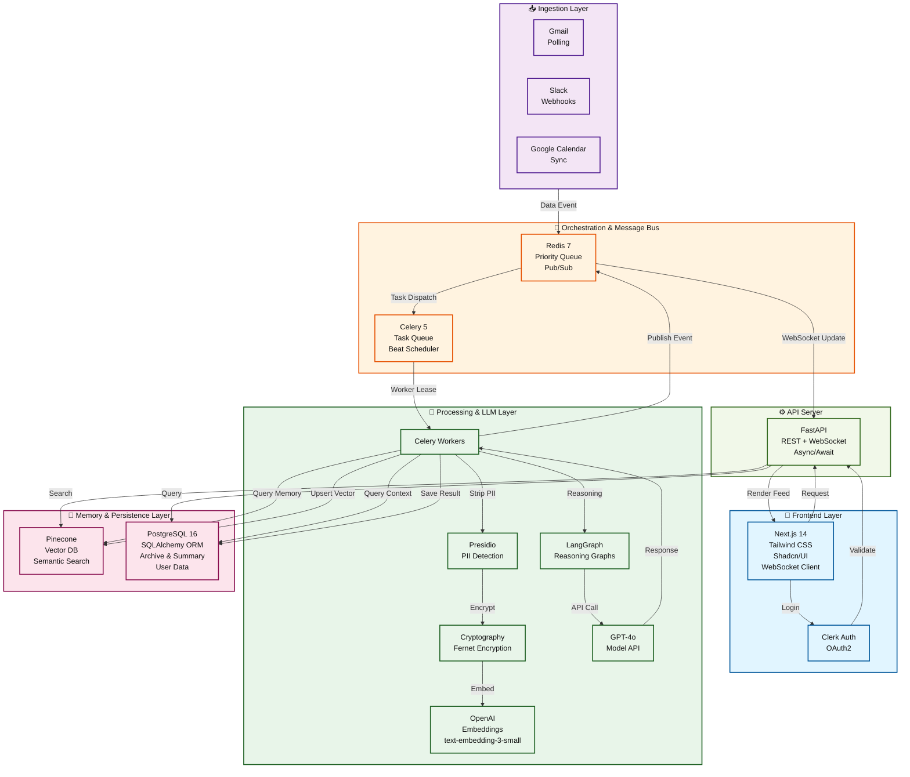

# High-Level Architecture Diagram

## End-to-End Tech Stack

---

## Layer Descriptions

### 📥 **Ingestion Layer**
- **Gmail Polling**: Monitors inbox for meeting invites and messages
- **Slack Webhooks**: Real-time channel and DM ingestion
- **Google Calendar**: Syncs events and extracts attendees
- Routes all events → Redis Priority Queue

### 🎯 **Orchestration & Message Bus**
- **Redis**: Single queue with priority lanes
  - Priority 1: Meeting prep (time-critical)
  - Priority 2: General ingestion & guide queries
  - Also serves as pub/sub bridge for WebSocket updates
- **Celery**: Background task runner with Beat scheduler for periodic polls

### 🧠 **Processing & LLM Layer**
- **Celery Workers**: Lease and execute tasks
- **Presidio**: NLP-based PII detection (emails, names, SSNs, phones)
- **Cryptography (Fernet)**: Per-user symmetric encryption of sensitive data
- **Embeddings**: OpenAI text-embedding-3-small for semantic search
- **LangGraph**: Stateful multi-node reasoning graphs for complex workflows
- **GPT-4o**: Primary LLM for synthesis, analysis, and decision-making

### 💾 **Memory & Persistence Layer**
- **Pinecone**: Vector database (managed, serverless)
  - Stores redacted embeddings
  - Enables semantic search by tags and metadata
  - Namespaces: `founder_memory`, `startup_playbooks`
- **PostgreSQL**: Structured data and archives
  - User accounts and auth
  - Raw encrypted content
  - Meeting summaries and prep cards
  - Promise tracking and agent runs

### ⚙️ **API Server**
- **FastAPI**: Async REST + WebSocket endpoints
  - Handles auth validation (via Clerk)
  - Queries memory and persistence layers
  - Pushes real-time updates to frontend

### 🎨 **Frontend Layer**
- **Next.js 14**: React with server components
- **Tailwind + Shadcn/UI**: Fast, accessible UI components
- **Clerk**: OAuth2 login and session management
- **WebSocket Client**: Real-time feed updates

---

## Data Flow Example: Meeting Prep

1. **Ingestion**: Google Calendar → Gmail event → Redis queue (Priority 1)
2. **Orchestration**: Celery leases task from Redis
3. **Processing**:
   - PII is stripped (names → `<PERSON_xxx>`, emails → `<EMAIL_xxx>`)
   - Redacted content is embedded
   - Semantic search queries Pinecone for related context
   - GPT-4o synthesizes a prep card
4. **Memory**: Result saved to Postgres; embeddings upserted to Pinecone
5. **Delivery**: Redis pub/sub → FastAPI → WebSocket → Next.js feed
6. **Frontend**: Founder sees prep card in real-time

---

## Security by Layer

| Layer | Protection |
|-------|-----------|
| **Ingestion** | OAuth2 credentials, webhook validation |
| **Processing** | PII detection & tokenization before LLM |
| **Memory** | Per-user Fernet encryption; raw content stored encrypted; vectors only redacted |
| **API** | JWT validation, role-based access control |
| **Frontend** | Session-based auth, private key material never sent to server |

---

## Deployment Model

- **Local Dev**: `docker-compose` (Redis, Postgres, FastAPI, Celery, Next.js)
- **Production**: Containerized services on Kubernetes or serverless
  - Redis: Managed (AWS ElastiCache or Redis Cloud)
  - Postgres: Managed (RDS or DigitalOcean)
  - Pinecone: Managed serverless (no ops required)
  - FastAPI + Celery: Container orchestration (K8s, ECS, or App Engine)
  - Next.js: Static hosting (Vercel, CloudFront) or container

---

## Why This Stack?

- **Scalability**: Redis + Celery handle priority queueing; Pinecone is infinitely scalable
- **Real-time**: WebSocket integration for instant card delivery
- **Security**: Encryption at rest, PII tokenization, per-user keys
- **Developer Experience**: Python async/await, auto OpenAPI docs, fast iteration
- **Cost**: Managed services (Pinecone, Clerk) reduce ops overhead

